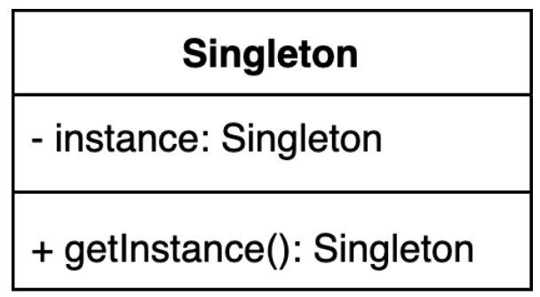
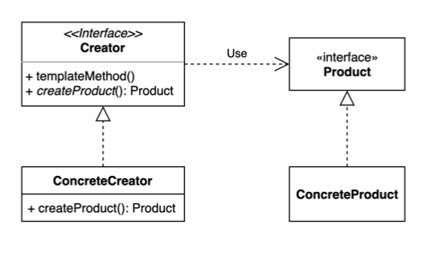
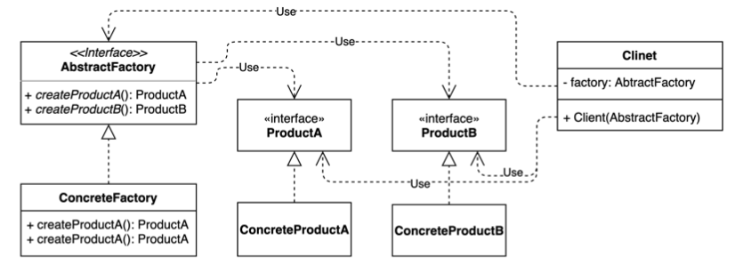
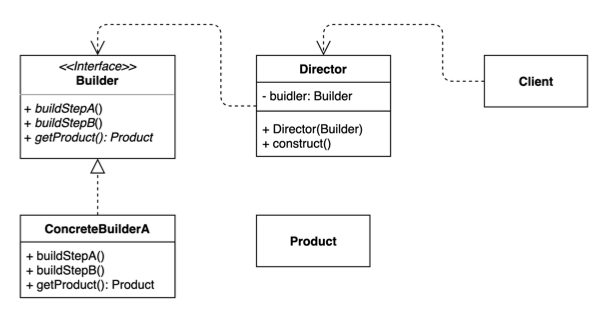
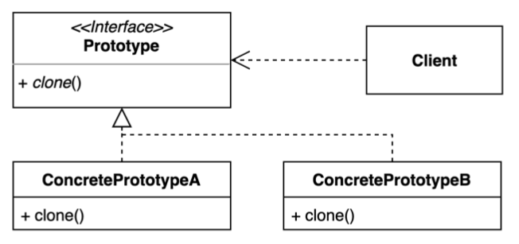

# design-pattern
design-pattern을 공부하기위한 레포지터리

## 객체 생성 관련
### 싱글톤 패턴

- 어떤 클래스의 객체를 오직 한개만 제공한다.
- 스프링에서 빈의 기본 스코프로 사용된다.
- 빌더, 파사드, 추상 팩토리 등 다른 디자인 패턴 구현체의 일부로 사용되기도 한다. 
- [`싱클톤 패턴 예제`](src/main/java/example/_1_creational/_1_singleton)

### 팩토리 메소드 패턴

- 어떤 객체를 생성하는 책임을 인터페이스로 추상화한다.
- 다양한 구현체가 있고, 그중에서 특정한 구현체를 만들 수 있는 다양한 팩토리를 제공할 수 있다.
- 확장에 열려있고 변경에 닫혀있는 개발을 할 수 있다.
- 구체적인 객체 생성 과정을 하위 또는 구체 클래스로 옮기는 것이 목적이다.
- [`팩토리 메소드 패턴 예제`](src/main/java/example/_1_creational/_2_factory_method)

### 추상 팩토리 패턴

- 다른 객체와 연관 관계를 가지는 구체 객체를 생성하는 책임을 인터페이스로 추상화한다.
- 팩토리 내부에서 연관 관계를 가지는 객체의 팩토리를 가지고 사용하는 방식이다.
- 관련있는 여러 객체를 구체 클래스에 의존하지 않고 생성하는 것이 목적이다.
- [`추상 팩토리 패턴 예제`](src/main/java/example/_1_creational/_3_abstract_factory)

### 빌더 패턴

- 동일한 프로세스를 거쳐 다양한 구성의 객체를 만드는 방법이다.
- 만들기 복잡한 객체를 만드는 방법을 제공한다.
- 복잡한 객체를 만드는 과정을 Director를 사용하여 감출 수 있다.
- [`빌더 패턴 예제`](src/main/java/example/_1_creational/_4_builder)

### 프로토타입 패턴

- 복제 가능한 인스턴스를 프로토타입으로 사용해서 새로운 인스턴스를 만들 수 있다.
- 기존 객체를 복제하는 과정이 새 인스턴스를 만드는 것보다 비용적인 측면에서 효율적일 수 있다.
- 자바를 사용하고 있다면 `Clonable` 인터페이스를 구현하여 사용하면 된다.
- 단, 자바의 기본 제공 clone 은 얕은 복사를 지원하기 때문에 깊은 복사 필요시 커스텀하여 구현해야 한다. 
- [`프로토타입 패턴 예제`](src/main/java/example/_1_creational/_5_prototype)

## 구조 관련

## 행동 관련

